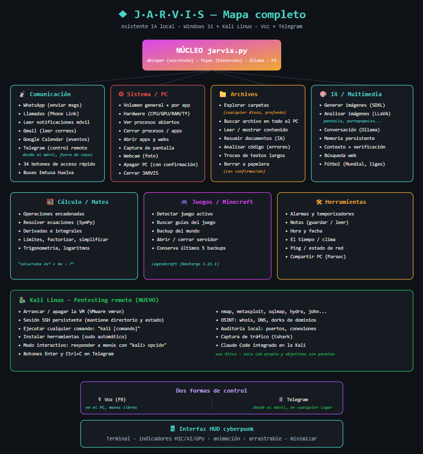

<div align="center">

```
     ██╗ █████╗ ██████╗ ██╗   ██╗██╗███████╗
     ██║██╔══██╗██╔══██╗██║   ██║██║██╔════╝
     ██║███████║██████╔╝██║   ██║██║███████╗
██   ██║██╔══██║██╔══██╗╚██╗ ██╔╝██║╚════██║
╚█████╔╝██║  ██║██║  ██║ ╚████╔╝ ██║███████║
 ╚════╝ ╚═╝  ╚═╝╚═╝  ╚═╝  ╚═══╝  ╚═╝╚══════╝
```

### Asistente de IA local · Voz + Telegram

`+80 funciones · Python · IA local · Control total del sistema`


[](https://youtu.be/T3hwXxf3abs)

</div>

---

## `▸` Qué es

**JARVIS** es un asistente personal de IA que corre **en local** en mi propio PC,
controlable por **voz** y por **Telegram** desde cualquier lugar. No es un chatbot:
ejecuta acciones reales sobre el sistema, integra más de 80 funciones y administra
hasta un entorno de pentesting en remoto.

Empezó como un experimento y creció hasta convertirse en una herramienta que uso
a diario. Todo el procesamiento de IA es local — sin depender de servicios en la nube.

---

## `▸` Qué sabe hacer

```
🎙️  VOZ                 Reconocimiento (Whisper) + síntesis de voz (Piper)
📱  TELEGRAM            Control remoto completo desde el móvil · 34 botones
🧠  IA LOCAL            Conversación con Ollama · sin nube
🎨  IMÁGENES            Genera imágenes (SDXL) y analiza pantalla (LLaVA)
⚙️   SISTEMA            Volumen, procesos, hardware, apps, apagado
📁  ARCHIVOS            Explorar, buscar, leer y resumir documentos con IA
📬  COMUNICACIÓN        Gmail, Google Calendar, WhatsApp, notificaciones
🐉  KALI LINUX          Administración remota de VM por SSH para pentesting
🧮  CÁLCULO             Ecuaciones, derivadas, integrales (SymPy)
🎮  JUEGOS              Detección de juego activo, backups de Minecraft
🛠️   HERRAMIENTAS        Alarmas, notas, clima, fútbol, y mucho más
```

---

## `▸` Mapa completo

<div align="center">



</div>

---

## `▸` Descarga la versión pública ⭐

Este repositorio incluye una **versión pública lista para usar** que puedes
montar en tu propio PC. Es la misma base, pero **recortada y configurable**:

- ✅ Todo se configura con un **menú al arrancar** (tu nombre, tu bot de Telegram,
  tus modelos de IA, qué módulos activar...). No tienes que tocar el código.
- ✅ Cada usuario mete **sus propios datos**, que se guardan en `config.json`.
- ✅ Incluye: voz, Telegram, IA local, imágenes, sistema, archivos, Gmail,
  Calendar, WhatsApp, copias de seguridad, cálculo, juegos y más.
- ❌ **No incluye** el módulo de Kali Linux / pentesting (esa parte es de mi
  entorno personal y queda fuera de la versión pública por seguridad).

### Cómo instalarla

```bash
# 1. Descarga el proyecto
git clone https://github.com/miguelrobles2002/jarvis
cd jarvis

# 2. Instala las dependencias
pip install -r requirements.txt

# 3. Instala Ollama (https://ollama.com) y los modelos
ollama pull qwen3:8b
ollama pull qwen2.5-coder:7b
ollama pull llava          # opcional, solo para análisis de imágenes

# 4. Arranca JARVIS (la primera vez te guía en la configuración)
python jarvis.py
```

> 📄 Consulta **[INSTALACION.md](INSTALACION.md)** para la guía completa paso a paso,
> incluyendo cómo configurar Telegram, Gmail y los módulos opcionales.

**Requisitos:** Windows 10/11 · Python 3.10+ · Ollama · (GPU con 8GB+ VRAM
recomendada para generar imágenes).

---

## `▸` Stack técnico

```
LENGUAJE     Python
IA / VOZ     Ollama · Whisper (STT) · Piper (TTS) · SDXL · LLaVA
INTEGRACIÓN  API de Telegram · Gmail API · Google Calendar API
SISTEMA      pywin32 · psutil · pyautogui · pycaw
REMOTO       paramiko (SSH) · VMware · Kali Linux
```

---

## `▸` Destacado técnico

- **Motor de detección de órdenes** que interpreta lenguaje natural (voz o texto)
  y lo mapea a más de 80 acciones distintas, gestionando prioridades y colisiones.
- **Puente Telegram ↔ Kali Linux**: sesión SSH persistente que permite ejecutar
  comandos, usar herramientas interactivas y administrar una VM de pentesting
  desde el móvil.
- **IA 100% local**: conversación, visión y generación de imágenes sin enviar
  datos a la nube.
- **Control real del sistema**: no solo responde, ejecuta acciones sobre el PC.

---

## `▸` Sobre el proyecto

JARVIS es un proyecto personal en desarrollo continuo. Nació de la curiosidad por
ver hasta dónde podía llevar un asistente hecho desde cero, y se ha convertido en
mi campo de pruebas para IA, automatización, integración de sistemas y seguridad.

> ⚠️ Las funciones de seguridad/pentesting están pensadas para uso ético:
> auditoría de sistemas propios y laboratorio de prácticas.

---

<div align="center">

`// Miguel Robles · Técnico Superior ASIR · 2026`

[Portfolio ↗](https://robles-it.netlify.app) · [YouTube ↗](https://www.youtube.com/@robles0797) · [LinkedIn ↗](https://www.linkedin.com/in/miguel-robles-medina-8a0315389) · [GitHub ↗](https://github.com/miguelrobles2002)

</div>
